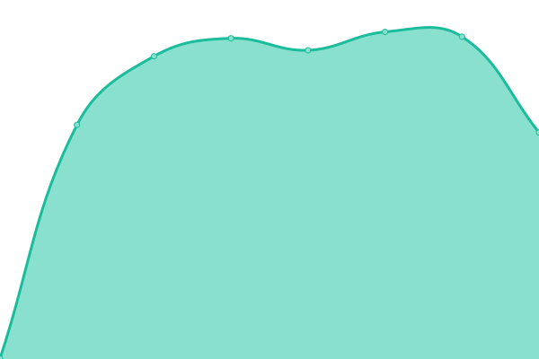
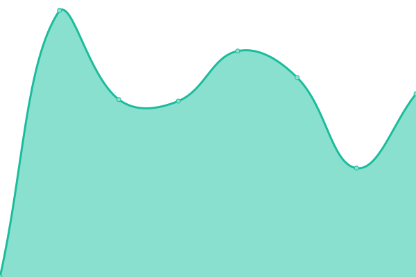

# [📈 Live Status](https://stud-lerngruppe22.github.io/Status): <!--live status--> **🟧 Partial outage**

This repository contains the open-source uptime monitor and status page for [Echte Informatiker](https://stud-lerngruppe22.github.io/Status), powered by [Upptime](https://github.com/upptime/upptime).

With [Upptime](https://upptime.js.org), you can get your own unlimited and free uptime monitor and status page, powered entirely by a GitHub repository. We use [Issues](https://github.com/stud-lerngruppe22/Status/issues) as incident reports, [Actions](https://github.com/stud-lerngruppe22/Status/actions) as uptime monitors, and [Pages](https://stud-lerngruppe22.github.io/Status) for the status page.

<!--start: status pages-->
<!-- This summary is generated by Upptime (https://github.com/upptime/upptime) -->
<!-- Do not edit this manually, your changes will be overwritten -->
<!-- prettier-ignore -->
| URL | Status | History | Response Time | Uptime |
| --- | ------ | ------- | ------------- | ------ |
|  [Lerngruppe22 Seite](https://stud-lerngruppe22.great-site.net/) | 🟥 Down | [lerngruppe22-seite.yml](https://github.com/stud-lerngruppe22/Status/commits/HEAD/history/lerngruppe22-seite.yml) | 

 680ms
     
 | 

<a href="https://stud-lerngruppe22.github.io/Status/history/lerngruppe22-seite">88.06%</a>
    

|  [FH-Dortmund](https://www.fh-dortmund.de/) | 🟩 Up | [fh-dortmund.yml](https://github.com/stud-lerngruppe22/Status/commits/HEAD/history/fh-dortmund.yml) | 

 1418ms
     
 | 

<a href="https://stud-lerngruppe22.github.io/Status/history/fh-dortmund">100.00%</a>
    

|  [Ilias](https://www.ilias.fh-dortmund.de) | 🟩 Up | [ilias.yml](https://github.com/stud-lerngruppe22/Status/commits/HEAD/history/ilias.yml) | 

 2128ms
     
 | 

<a href="https://stud-lerngruppe22.github.io/Status/history/ilias">100.00%</a>
    

|  [Portal](https://portal.fh-dortmund.de/qisserver/pages/cs/sys/portal/hisinoneStartPage.faces) | 🟥 Down | [portal.yml](https://github.com/stud-lerngruppe22/Status/commits/HEAD/history/portal.yml) | 

 0ms
     
 | 

<a href="https://stud-lerngruppe22.github.io/Status/history/portal">100.00%</a>
    

|  [Fachhoch.schule](https://fachhoch.schule/) | 🟩 Up | [fachhoch-schule.yml](https://github.com/stud-lerngruppe22/Status/commits/HEAD/history/fachhoch-schule.yml) | 

 987ms
     
 | 

<a href="https://stud-lerngruppe22.github.io/Status/history/fachhoch-schule">92.40%</a>
    

<!--end: status pages-->

[**Visit our status website →**](https://stud-lerngruppe22.github.io/Status)

## 📄 License

- Powered by: [Upptime](https://github.com/upptime/upptime)
- Code: [MIT](./LICENSE) © [Anand Chowdhary](https://anandchowdhary.com), supported by [Pabio](https://pabio.com)
- Data in the `./history` directory: [Open Database License](https://opendatacommons.org/licenses/odbl/1-0/)
